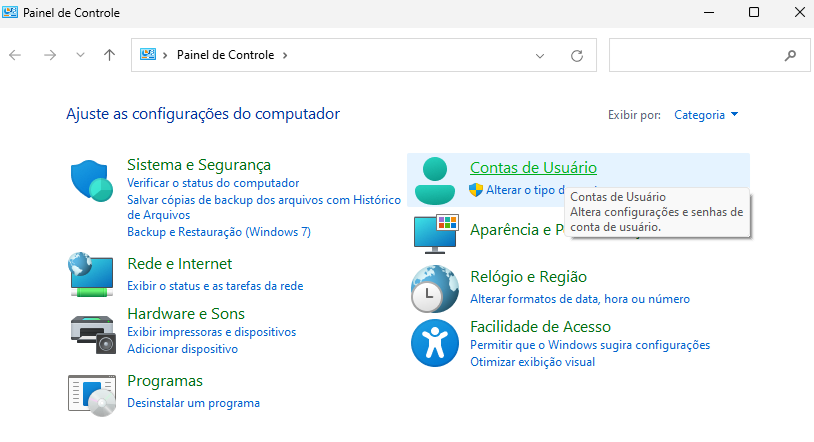
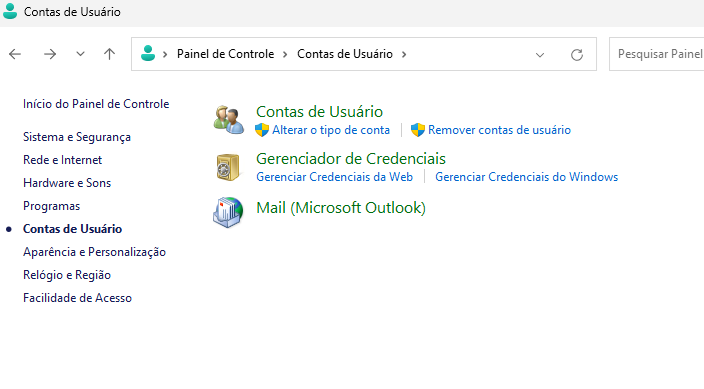
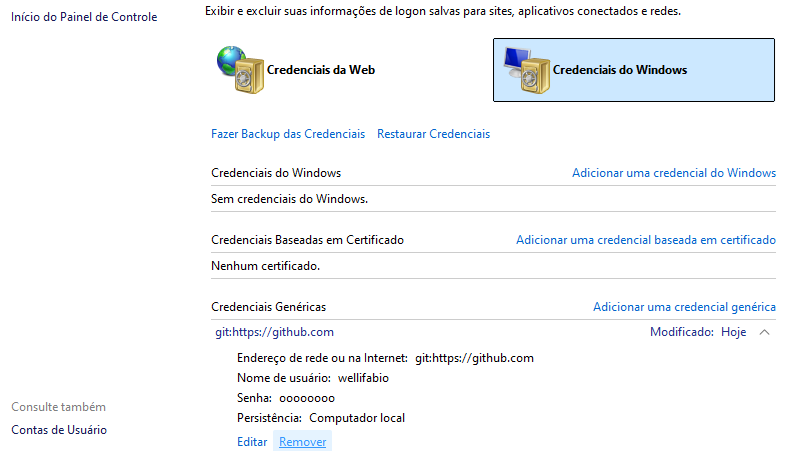
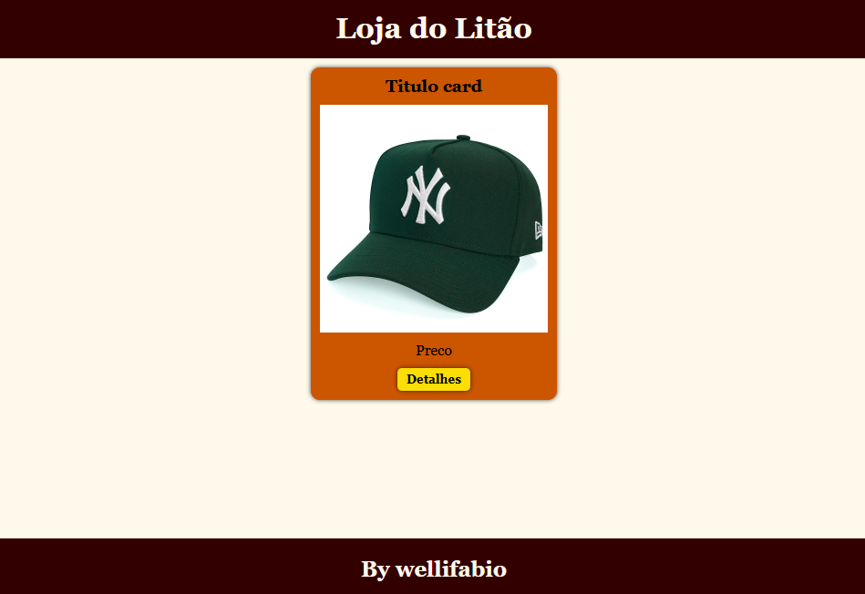
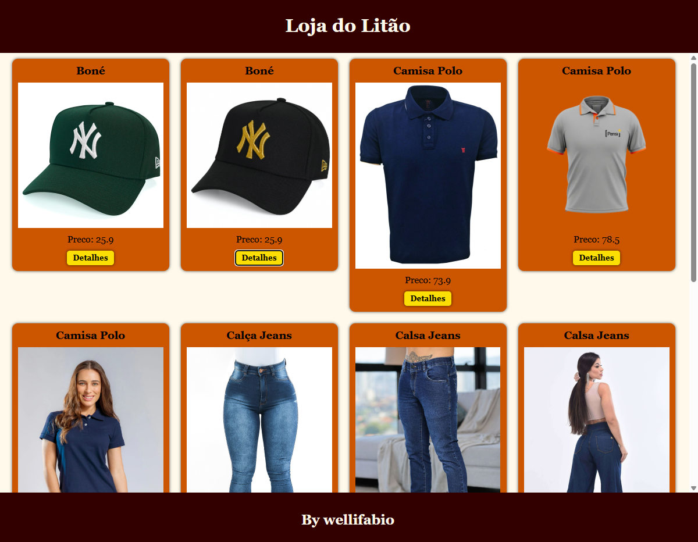
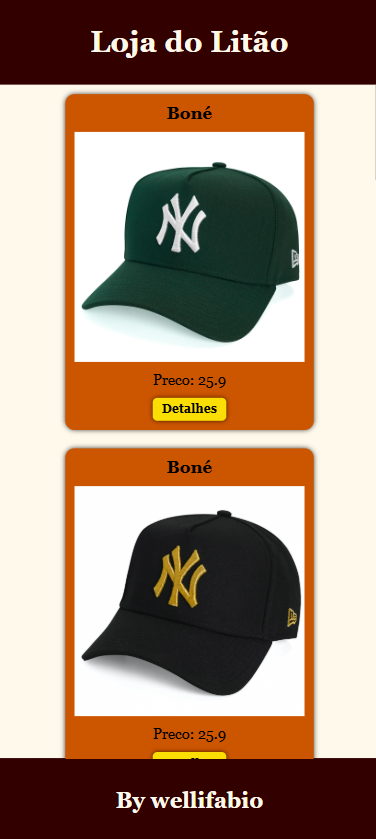

# Aula 02
#### [Link do repositório com o exemplo visto em aula](https://github.com/wellifabio/loja-pfe01-aula02.git)
## Capacidades Técnicas
- 1 Utilizar semântica de linguagem de marcação conforme normas
- 2 Elaborar formulários de página web
- 3 Utilizar ferramentas gráficas para interface web e mobile
- 4 Adequar a interface web para diferentes dispositivos de acesso

## Conhecimentos
- 1 JavaScript
    - 1.1 Operadores
        - 1.1.1 Aritméticos
        - 1.1.2 Relacionais
        - 1.1.3 Lógicos
    - 1.2 Funções
        - 1.2.1 Data e hora
        - 1.2.2 Matemáticas
        - 1.2.3 String
    - 1.3 DOM (Document Object Model)
        - 1.3.1 Seleção de elementos
        - 1.3.2 Manipulação de elementos

## Demonstração com replica prática
- 1 Criar um github repositório público chamado **loja-pfe01-aula02**
- 2 Clonar ele na área de trabalho e configurar o computador para que o git seja o seu, com os comandos
```bash
git clone endereço do repositório
git config --global user.name "wellifabio"
git config --global user.email "seu@email.com"
git config --list
```
- 3 Criamos os arquivos index.html, style.css, script.js
- 4 Enviamos para o repositório remoto github
```bash
git add .
git commit -m "primeiro commit"
git push
```
- Se o nosso computador estiver configurado para o git de outra pessoa.
    - Abrimos o painel de controle e removemos as credenciais de outro aluno
    - 
    - 
    - 
- E repetimos o processo
```bash
git add .
git commit -m "primeiro commit"
git push
```
 ### Mock ou Mockup
 - Como não temos um back-end criaremos um JSON com os dados que serão renderizados.
 - assets/dados.json
 ```json
 [
    {
        "id":1,
        "produto":"Boné",
        "descricao":"Boné verde",
        "preco":25.9,
        "imagem":"https://static.prospin.com.br/media/catalog/product/m/b/mbv23bon090-bone-new-era-940-new-york-yankees-aba-curva-verde.jpg"
    },
    {
        "id":2,
        "produto":"Boné",
        "descricao":"Boné preto",
        "preco":25.9,
        "imagem":"https://static.prospin.com.br/media/catalog/product/cache/0e3f1fa1e1f5782c73be0e8cb4ab3f9d/m/b/mbi22bon122-bone-new-era-9forty-a-frame-snapback-aba-curva-mlb-new-york-yankees.jpg"
    },
    {
        "id":3,
        "produto":"Camisa Polo",
        "descricao":"Camisa Polo Azul",
        "preco":73.9,
        "imagem":"https://58532.cdn.simplo7.net/static/58532/sku/masculino-camisas-polo-camisa-polo-tradicional--p-0349-1606916620225.jpeg"
    },
    {
        "id":4,
        "produto":"Camisa Polo",
        "descricao":"Camisa Polo Cinza Pensi",
        "preco":78.5,
        "imagem":"https://images.tcdn.com.br/img/img_prod/231785/camisa_polo_cinza_pensi_4601_1_51d77e289285b4274bc620cfae5b1d6b.png"
    },
    {
        "id":5,
        "produto":"Camisa Polo",
        "descricao":"Camisa Polo Feminina Azul Marinho",
        "preco":125.9,
        "imagem":"https://cdn.awsli.com.br/2500x2500/1226/1226626/produto/111503404/fe63cd34c2.jpg"
    },
    {
        "id":6,
        "produto":"Calça Jeans",
        "descricao":"Calça Jeans Feminina Básica Up Azul Safira",
        "preco":25.9,
        "imagem":"https://acdn-us.mitiendanube.com/stores/003/859/035/products/4b0cf032e73b8f1db3051c6ac9684c02-266c122c062ad6393217085351637450-1024-1024.jpg"
    },
    {
        "id":7,
        "produto":"Calsa Jeans",
        "descricao":"Calça Jeans Com Elástano e Cós Interno Personalizado Masculina",
        "preco":85.9,
        "imagem":"https://www.revanche.com.br/media/catalog/product/cache/8e5872966dd88cc0e998d2d2c4eec43a/c/a/cal_a-jeans-com-el_stano-e-c_s-interno-personalizado-atacado-masculina-revanche-gurupi386a4527.jpg"
    },
    {
        "id":8,
        "produto":"Calsa Jeans",
        "descricao":"Calça Jeans Pantalona Jeans Feminina",
        "preco":125.9,
        "imagem":"https://s.soljeans.com/product/2023/10/calca-jeans-pantalona-jeans-feminina-2-1710193317.jpg"
    },
    {
        "id":9,
        "produto":"Cueca",
        "descricao":"Cueca Plus Size Masculina Cos Kit Azul Com 3 - Mais Pano",
        "preco":85.9,
        "imagem":"https://cdn.maispano.com.br/media/catalog/product/cache/1/image/1000x/9df78eab33525d08d6e5fb8d27136e95/c/u/cueca-plus-size-azul-ce016005_3.jpg"
    },
    {
        "id":10,
        "produto":"Cueca",
        "descricao":"Cueca Plus Size Básica Kit Petroleo Com 3 - Mais Pano",
        "preco":75.9,
        "imagem":"https://cdn.maispano.com.br/media/catalog/product/cache/1/image/9df78eab33525d08d6e5fb8d27136e95/1/3/1340005.jpg"
    },
    {
        "id":11,
        "produto":"Cueca",
        "descricao":"Cueca Boxer Algodão Azul Plus Size 000852 - PlusMan Brasil",
        "preco":28.35,
        "imagem":"https://www.plusmanbrasil.com.br/wp-content/uploads/2020/10/PLUS-SIZE-PlusmanBrasil-Cueca-Boxer-000852-2-1.jpg"
    }
    
]
 ```
 #### Carregando dados em CARDs
 - Criar a UI web com linguagens de marcação HTMLe CSS estilizando um único **card**
 - 
 - Criar um script para carregar os outros cards
 ```js
 const uri = './assets/dados.json';
var produtos = [];

//Carrega os dados do Mockup
fetch(uri)
    .then(resp => resp.json())
    .then(resp => { produtos = resp; })
    .then(() => mostrarCards())

function mostrarCards() {
    const main = document.querySelector('main');
    produtos.forEach(p => {
        main.innerHTML += `
        <div class="card">
            <h3>${p.produto}</h3>
            
            <p>Preco: ${p.preco}</p>
            <button>Detalhes</button>
        </div>
        `;
    })
}
```
- 
- 

