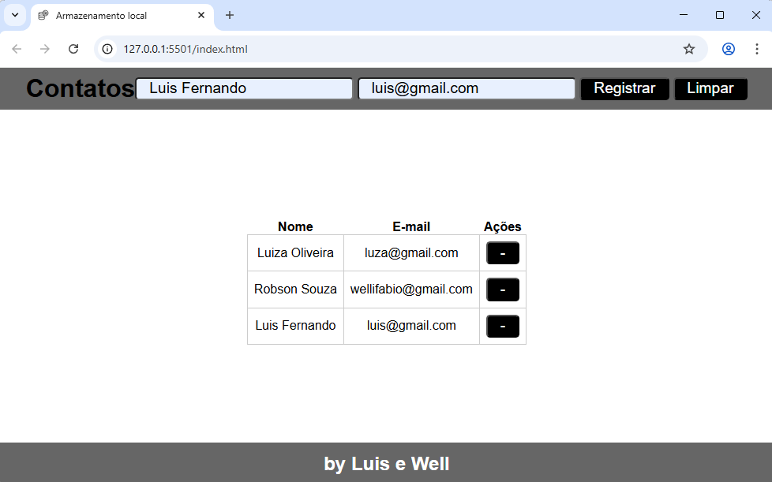
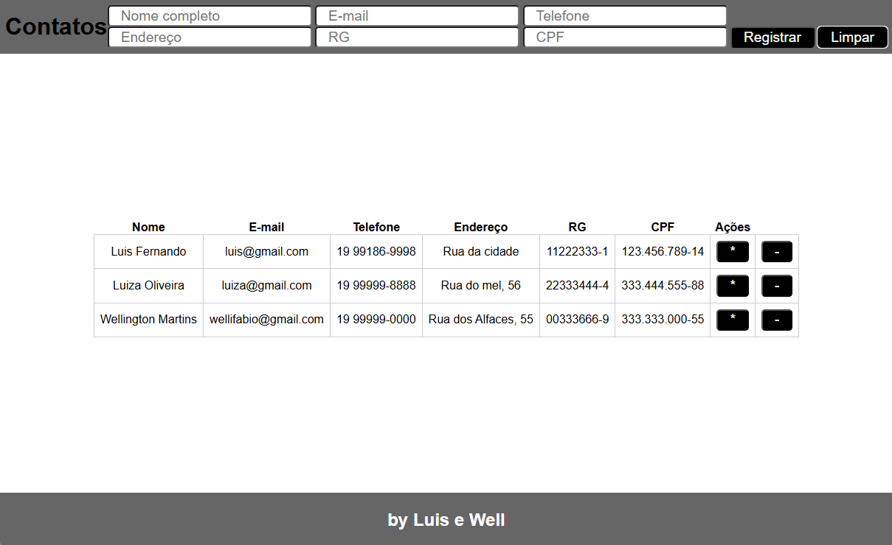
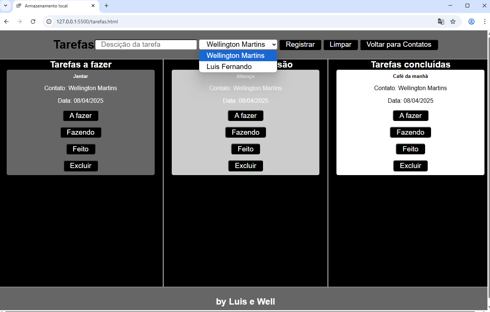
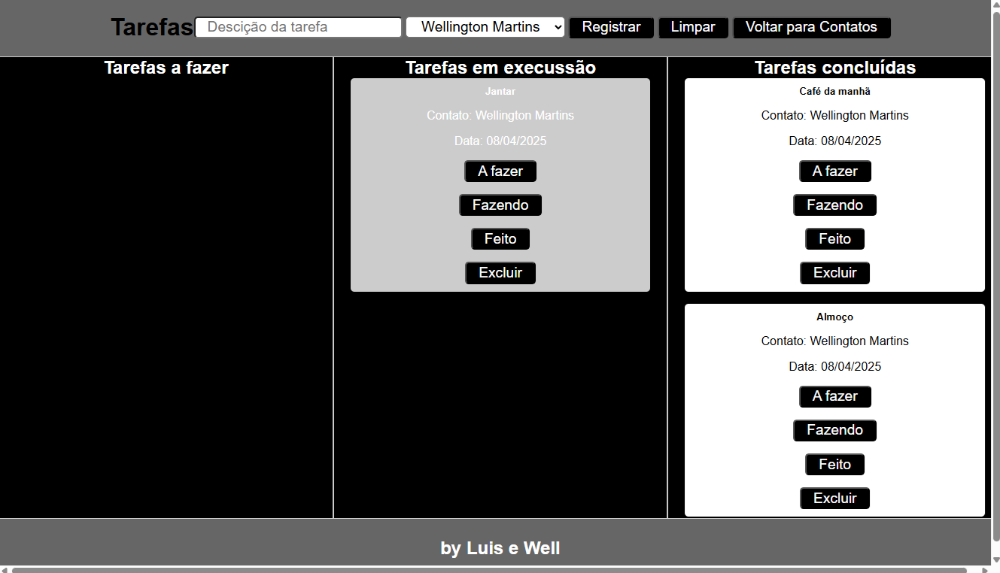

# Aula03 - DOM - Local Storage
- DOM (Objetos locais HTML)
- window.localStorage (Objeto de armazenamento local)

## Demonstração

- [Código visto em aula](./contatos/)
## Atividade01
- No projeto visto em aula, acrescente no formulário e na tabela os campos:
    - Endereço, Telefone, RG e CPF
    - Acrescente um botão de ação em cada linha da tabela para editar
        - ao clicar no botão os dados da linha da tabela devem ser preenchidos no formulário, podendo ser editados e ao clicar em **Registrar** devem ser alterados na tabela.
    - Melhore a estilização CSS a sua escolha.
- 

## Atividade02
### Cadastro de atividades
- Acrescente uma nova página html chamada **tarefas.html**
- No cabeçalho da pagina principal crie um botão para direcionar para esta página.
- Ná página de tarefas crie um formulário com os campos do wireframe a seguir:
- 
- No select deverá aparecer os contatos cadastrados na página anterior
- Ao clicar em Registrar a nova terefa deve ser cadastrada em uma lista e esta salva no localStorage com o nome do ítem "tarefas"
- As tarefas devem ser listadas em três colunas conforme o seu status ["afazer","fazendo","feito"] conforme wireframe a seguir:
- 
- Cada card de tarefa deve ter 4 botões, um para cada status e um para excluir
    - Ao clicar no bortão do status o card deve ir para a coluna indicada

### Entregas
- Crie um repositório público github chamado **pfe1-aula03-contatos** suba os códigos e habilite o gitpages.
- Envie o link do gitpages neste **[Formulário](https://forms.gle/cgGFBrMza93ksf9t8)**