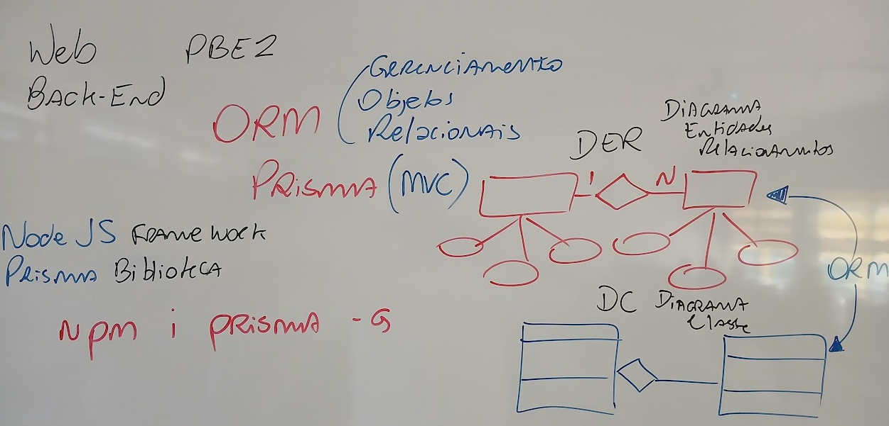
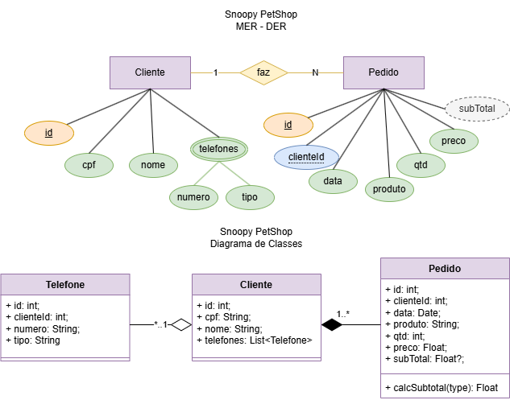
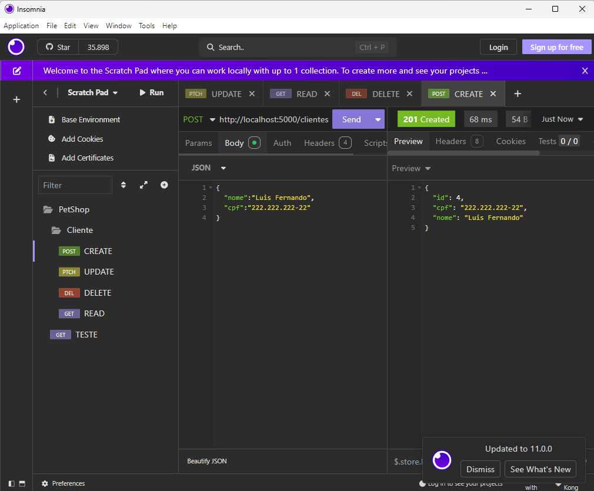

# Aula03 - ORM Prisma

- ORM (Object Relationship Management)
## Demonstração
Projeto modelo com prisma **[SNOOPY PetShop](https://github.com/wellifabio/pbe2-aula03-prisma-2025.git)**
- 
### Step by Step
- Iniciar um projeto com prisma
- 1 Ter um documento DER ou DC
- 2 Criar um repositório
- 3 Clonar o repositório e abrir com VsCode
- 4 Criar a pasta API e o arquivo server
- 5 Abrir um terminal CTRL + ' e dar os comandos a seguir para iniciar o projeto
```bash
cd api
npm init -y
npm i express cors dotenv
```
- Iniciar o uso do Prisma instalaremos ele globalmente
```bash
npm i prisma -g
```
- Conctar o prisma ao um SGBD MySQL
```bash
npx prisma init --datasource-provider mysql
```
- Editar a variável de ambiente DATABASE_URL e PORT no arquivo **.env**
```js
DATABASE_URL="mysql://root@localhost:3306/petshop?schema=public&timezone=UTC"
PORT=5000
```
- Navegar até o arquivo ./prisma/schema.prisma
```js
generator client {
  provider = "prisma-client-js"
}

datasource db {
  provider = "mysql"
  url      = env("DATABASE_URL")
}

model Cliente{
  id Int @id @default(autoincrement())
  cpf String? @db.VarChar(20) @unique
  nome String
  telefones Telefone[]
  pedidos Pedido[]
}

model Telefone{
  id Int @id @default(autoincrement())
  clienteId Int
  numero String @db.VarChar(20)
  tipo String @db.VarChar(20)
  cliente Cliente @relation(fields: [clienteId], references: [id])
}

model Pedido{
  id Int @id @default(autoincrement())
  clienteId Int
  data DateTime @default(now())
  produto String
  qtd Int
  preco Decimal @db.Decimal(10,2)
  subTotal Decimal? @db.Decimal(10,2)
  cliente Cliente @relation(fields: [clienteId], references: [id])
}
```
- Como os modelos prontos no schema Realizar a migração
```bash
npx prisma migrate dev --name init
```
- Caso seja necessário remover o banco de dados para testar a criação novamente
    - Exclua a pasta migrations
```bash
prisma migrate reset
```
- Editar o .gitignore
```js
node_modules
# Keep environment variables out of version control
.env
prisma/migrations
package-lock.json
```
- Editar o arquivo server.js
```js
require('dotenv').config();
const express = require('express');
const cors = require('cors');
const app = express();

const router = require('./src/router');

app.use(cors());
app.use(express.json());
app.use(router);

app.listen(process.env.PORT,()=>{
    console.log('API respondendo em http://localhost:'+process.env.PORT);
});
```
- Editar as rotas src/router.js
```js
const express = require('express');
const router = express.Router();

const Cliente = require('./controllers/cliente');

router.get('/',(req, res)=>{
    res.json({titulo:'SNOOPY PetSHop API'});
});

router.post('/clientes',Cliente.create);
router.get('/clientes',Cliente.read);
router.patch('/clientes/:id',Cliente.update);
router.delete('/clientes/:id',Cliente.remove);

module.exports = router;
```
- Editar os controles iniciando pelo Cliente
```js
const { PrismaClient } = require('@prisma/client');
const prisma = new PrismaClient();

const create = async (req, res) => {
    try {
        const cliente = await prisma.cliente.create({
            data: req.body
        });
        res.status(201).json(cliente).end();
    } catch (e) {
        res.status(400).json(e).end();
    }
}

const read = async (req, res) => {
    const clientes = await prisma.cliente.findMany();
    res.json(clientes);
}

const update = async (req, res) => {
    try {
        const cliente = await prisma.cliente.update({
            data: req.body,
            where: {
                id: Number(req.params.id)
            }
        });
        res.status(202).json(cliente).end();
    } catch (e) {
        res.status(400).json(e).end();
    }
}

const remove = async (req, res) => {
    try {
        const cliente = await prisma.cliente.delete({
            where: {
                id: Number(req.params.id)
            }
        });
        res.status(204).json(cliente).end();
    } catch (e) {
        res.status(400).json(e).end();
    }
}

module.exports = {
    create,
    read,
    update,
    remove
}
```
- Testar utilizando o Insomnia
- 

## Atividade
- Conclua os controles, rotas e testes das classes **Telefone** e **Pedido**

## Destaques do Kahoot
- 1 Mellyssa
- 2 Evelyn
- 3 Steffany
