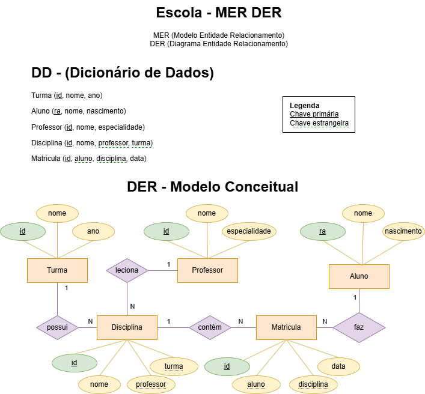
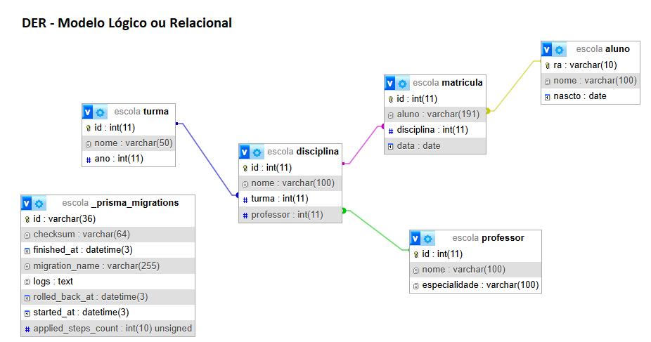
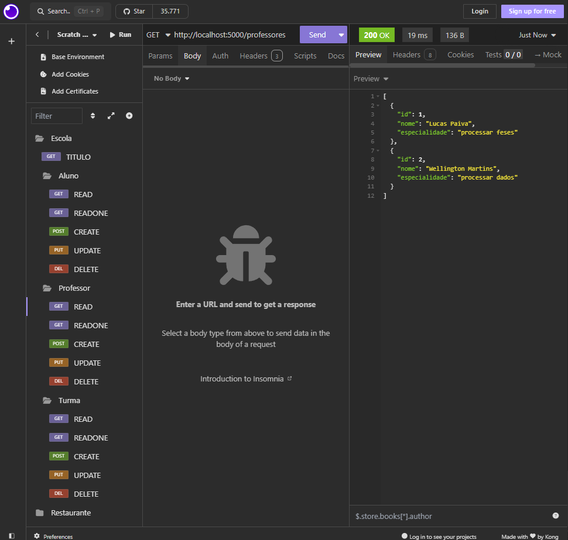

# Aula04 - ORM Prisma (Relacionamentos)
- A principal vantagem na utilização de um ORM é a versatilidade nos relacionamentos.
## Demonstração
- A partir do Modelo Entidade Relacionamento a Seguir vamos codificar um Sismtema para uma escola genérica.
- 
## Crie um novo projeto chamado escola
- Abra o XAMPP Controll Panel e clique em **start** em **MySQL**.
- Criem uma pasta chamada **escola** abra com **VsCode**, dentro dela crie uma subpasta **api** com um arquivo **server.js** e inicie seu projeto com prisma utilizando um terminal **CTRL + '**
```bash
cd api
npm i prisma -g
npm init -y
npm i express cors dotenv
npx prisma init --datasource-provider mysql
```
- Altere o endereço do arquivo **.env** para:
```js
DATABASE_URL="mysql://root@localhost:3306/escola?schema=public&timezone=UTC"
```
- Vamos editar o modelo no arquivo **./prisma/schema.prisma**
```js
generator client {
  provider = "prisma-client-js"
}

datasource db {
  provider = "mysql"
  url      = env("DATABASE_URL")
}

model Aluno{
  ra String @id @db.VarChar(10)
  nome String @db.VarChar(100)
  nascto DateTime? @db.Date
  matriculas Matricula[]
}

model Professor{
  id Int @id @default(autoincrement())
  nome String @db.VarChar(100)
  especialidade String @db.VarChar(100)
  disciplinas Disciplina[]
}

model Turma{
  id Int @id @default(autoincrement())
  nome String @db.VarChar(50)
  ano Int
  disciplinas Disciplina[]
}

model Disciplina{
  id Int @id @default(autoincrement())
  nome String @db.VarChar(100)
  turma Int
  professor Int
  possui Turma @relation(fields: [turma], references: [id])
  leciona Professor @relation(fields: [professor], references: [id])
  matriculas Matricula[]
}

model Matricula{
  id Int @id @default(autoincrement())
  aluno String
  disciplina Int
  data DateTime @db.Date @default(now())
  faz Aluno @relation(fields: [aluno], references: [ra])
  contem Disciplina @relation(fields: [disciplina], references: [id])
}
```
- Faremos a migração do banco de dados para o MySQL através do comando a seguir no terminal
```bash
npx prisma migrate dev --name init
```
- O Banco de dados será migrado e se quisermos conferir podemos abrir o PHPMyAdmin e verificar o **Desenhador**
- 
### Seguiremos com os arquivos ./server.js, ./src/routes.js e os controllers
- server.js
```js
const express = require('express');
const cors = require('cors');
const app = express();

const routes = require('./src/routes');

app.use(cors());
app.use(express.json());
app.use(routes);

app.listen(5000, () => {
  console.log('API executando em http://localhost:5000');
});
```
- src/routes.js
```js
const express = require('express');
const routes = express.Router();

const Aluno = require('./controllers/aluno');
const Professor = require('./controllers/professor');
const Turma = require('./controllers/turma');
const Disciplina = require('./controllers/disciplina');
const Matricula = require('./controllers/matricula');

routes.get('/', (req, res) => {
  return res.json({ titulo: 'Escola Superior PW' });
});

routes.post('/alunos', Aluno.create);
routes.get('/alunos', Aluno.read);
routes.get('/alunos/:ra', Aluno.readOne);
routes.put('/alunos/:ra', Aluno.update);
routes.delete('/alunos/:ra', Aluno.remove);

routes.post('/professores', Professor.create);
routes.get('/professores', Professor.read);
routes.get('/professores/:id', Professor.readOne);
routes.put('/professores/:id', Professor.update);
routes.delete('/professores/:id', Professor.remove);

routes.post('/turmas', Turma.create);
routes.get('/turmas', Turma.read);
routes.get('/turmas/:id', Turma.readOne);
routes.put('/turmas/:id', Turma.update);
routes.delete('/turmas/:id', Turma.remove);

routes.post('/disciplinas', Disciplina.create);
routes.get('/disciplinas', Disciplina.read);
routes.get('/disciplinas/:id', Disciplina.readOne);
routes.put('/disciplinas/:id', Disciplina.update);
routes.delete('/disciplinas/:id', Disciplina.remove);

module.exports = routes;
```
- ./src/controllers/aluno.js
```js
const { PrismaClient } = require('@prisma/client');
const prisma = new PrismaClient();

const create = async (req, res) => {
    try {
        const aluno = await prisma.aluno.create({
            data: req.body
        });
        return res.status(201).json(aluno);
    } catch (error) {
        return res.status(400).json({ error: error.message });
    }
}

const read = async (req, res) => {
    const alunos = await prisma.aluno.findMany();
    return res.json(alunos);
}

const readOne = async (req, res) => {
    try {
        const aluno = await prisma.aluno.findUnique({
            select: {
                ra: true,
                nome: true,
                nascto: true,
                matriculas: true
            },
            where: {
                ra: req.params.ra
            }
        });
        return res.json(aluno);
    } catch (error) {
        return res.status(400).json({ error: error.message });
    }
}

const update = async (req, res) => {
    try {
        const aluno = await prisma.aluno.update({
            where: {
                ra: req.params.ra
            },
            data: req.body
        });
        return res.status(202).json(aluno);
    } catch (error) {
        return res.status(400).json({ error: error.message });
    }
}

const remove = async (req, res) => {
    try {
        await prisma.aluno.delete({
            where: {
                ra: req.params.ra
            }
        });
        return res.status(204).send();
    } catch (error) {
        return res.status(404).json({ error: error.message });
    }
}

module.exports = { create, read, readOne, update, remove };
```
- ./src/controllers/professor.js
```js
const { PrismaClient } = require('@prisma/client');
const prisma = new PrismaClient();

const create = async (req, res) => {
    try {
        const professor = await prisma.professor.create({
            data: req.body
        });
        return res.status(201).json(professor);
    } catch (error) {
        return res.status(400).json({ error: error.message });
    }
}

const read = async (req, res) => {
    const professors = await prisma.professor.findMany();
    return res.json(professors);
}

const readOne = async (req, res) => {
    try {
        const professor = await prisma.professor.findUnique({
            select: {
                id: true,
                nome: true,
                especialidade: true,
                disciplinas: true
            },
            where: {
                id: Number(req.params.id)
            }
        });
        return res.json(professor);
    } catch (error) {
        return res.status(400).json({ error: error.message });
    }
}

const update = async (req, res) => {
    try {
        const professor = await prisma.professor.update({
            where: {
                id: Number(req.params.id)
            },
            data: req.body
        });
        return res.status(202).json(professor);
    } catch (error) {
        return res.status(400).json({ error: error.message });
    }
}

const remove = async (req, res) => {
    try {
        await prisma.professor.delete({
            where: {
                id: Number(req.params.id)
            }
        });
        return res.status(204).send();
    } catch (error) {
        return res.status(404).json({ error: error.message });
    }
}

module.exports = { create, read, readOne, update, remove };
```
- ./src/controllers/turma.js
```js
const { PrismaClient } = require('@prisma/client');
const prisma = new PrismaClient();

const create = async (req, res) => {
    try {
        const turma = await prisma.turma.create({
            data: req.body
        });
        return res.status(201).json(turma);
    } catch (error) {
        return res.status(400).json({ error: error.message });
    }
}

const read = async (req, res) => {
    const turmas = await prisma.turma.findMany();
    return res.json(turmas);
}

const readOne = async (req, res) => {
    try {
        const turma = await prisma.turma.findUnique({
            select: {
                id: true,
                nome: true,
                ano: true,
                disciplinas: true
            },
            where: {
                id: Number(req.params.id)
            }
        });
        return res.json(turma);
    } catch (error) {
        return res.status(400).json({ error: error.message });
    }
}

const update = async (req, res) => {
    try {
        const turma = await prisma.turma.update({
            where: {
                id: Number(req.params.id)
            },
            data: req.body
        });
        return res.status(202).json(turma);
    } catch (error) {
        return res.status(400).json({ error: error.message });
    }
}

const remove = async (req, res) => {
    try {
        await prisma.turma.delete({
            where: {
                id: Number(req.params.id)
            }
        });
        return res.status(204).send();
    } catch (error) {
        return res.status(404).json({ error: error.message });
    }
}

module.exports = { create, read, readOne, update, remove };
```
### Realizar os testes com insomnia

### Vamos desenvolver os CRUDS de Disciplinas e Matrículas
- ./src/controllers/disciplina.js
```js
const { PrismaClient } = require('@prisma/client');
const prisma = new PrismaClient();

const create = async (req, res) => {
    try {
        const disciplina = await prisma.disciplina.create({
            data: req.body
        });
        res.status(201).json(disciplina);
    } catch (error) {
        if (error.code == 'P2003')
            res.status(404).json({ erro: error.meta.field_name + ' não encontrada(o)' });
        else
            res.status(400).json(error);
    }
};

const read = async (req, res) => {
    const disciplinas = await prisma.disciplina.findMany();
    res.status(200).json(disciplinas);
};

const readOne = async (req, res) => {
    try {
        const disciplina = await prisma.disciplina.findUnique({
            select: {
                id: true,
                nome: true,
                turma: true,
                professor: true,
                possui: {
                    select: {
                        nome: true
                    }
                },
                leciona: {
                    select: {
                        nome: true
                    }
                },
                matriculas: true
            },
            where: {
                id: Number(req.params.id)
            }
        });
        return res.json(disciplina);
    } catch (error) {
        return res.status(400).json({ error: error.message });
    }
}

const update = async (req, res) => {
    try {
        const disciplina = await prisma.disciplina.update({
            where: {
                id: Number(req.params.id)
            },
            data: req.body
        });
        return res.status(202).json(disciplina);
    } catch (error) {
        return res.status(400).json({ error: error.message });
    }
}

const remove = async (req, res) => {
    try {
        await prisma.disciplina.delete({
            where: {
                id: Number(req.params.id)
            }
        });
        return res.status(204).send();
    } catch (error) {
        return res.status(404).json({ error: error.message });
    }
}

module.exports = {
    create,
    read,
    readOne,
    update,
    remove
};
```

## Atividades
- Crie o CRUD de Matrículas
- Teste o sistema cadastrando
    - 5 Professores
    - 15 alunos
    - 3 Turmas
    - 5 Disciplinas por turma
    - Matricule os 15 alunos em todas as 5 disciplinas (75 matrículas)
- Altere o **readOne** do controlle turma para que mostre os dados:
    - Turma {disciplinas{alunos,professores}}

### [Repositório do projeto concluído](https://github.com/wellifabio/pbe2-aula04-escola-2025.git)
Contendo os dados de teste sendo semeados a partir de documentos JSON