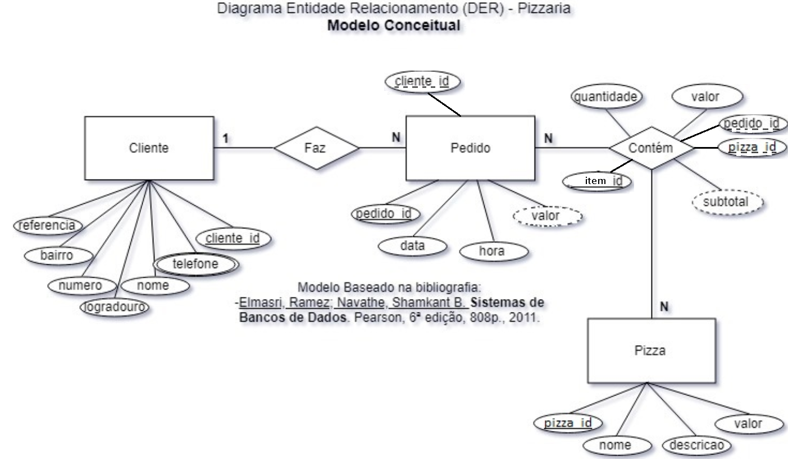

## Aula05 - VPF01 (Verificação Prática Formativa)
### Prisma
- A situação de aprendizagem a seguir deve ser desenvolvida com **Node.JS** e **ORM Prisma** com interação com o Banco de dados **MySQL**.
- Os testes devem ser realizados via **Insomnia**

### Situação de Aprendizagem
Pizzaria Ginno e Silva

#### Contextualização
Você faz parte de uma equipe de desenvolvimento e atua como programador back-end. A pizzaria Pizzaria Ginno e Silva é cliente da sua empresa e deseja um sistema para gerenciar seus pedidos para delivery.  O P.O. da equipe elaborou o DER abaixo para o banco de dados do sistema. 

- OBS:
    - Logradouro é uma rua, avenida, praça, etc.
    - O campo telefone é multivalorado, ou seja, pode ter mais de um telefone cadastrado para o cliente.
        - Neste caso o campo telefone seria uma tabela com os campos: id, cliente_id, telefone.
        - Porém para simplificar o desafio, o campo telefone será uma string com 255 caracteres.

#### Desafio
Desenvolver o back-end do sistema de gerenciamento de pedidos para delivery da Pizzaria Ginno e Silva seguindo as regras de negócio a seguir.

#### Requisitos funcionais (50%)
- [RF001] O sistema deve permitir o CRUD de pizzas.
- [RF002] O sistema deve permitir o CRUD de clientes.
- [RF003] O sistema deve permitir o CRUD de pedidos.
- [RF003.1] O sistema deve associar o pedido a um cliente.
- [RF003.2] O sistema deve permitir a inclusão de pizzas no pedido (ítens do pedido).

#### Casos de teste (Insomnia) (50%)
- [CT001] Deve ser cadastrada 10 pizzas.
- [CT002] Deve ser cadastrado 5 clientes.
- [CT003] Deve ser cadastrado 5 pedidos um para cada cliente, contendo de 1 a 3 pizzas por pedido. Pelo menos um dos pedidos deve conter 3 pizzas.
- [CT004] No Controle de pedidos deve possuir uma rota readOne que retorne o pedido com o id informado. Os dados do cliente e a lista de pizzas.

#### Entregas
- Repositório público no GitHub chamado **pbe2-vpf01-2025** com o código fonte do projeto seguindo a seguinte estrutura de pastas:
- `api/` contendo o código fonte do projeto.
- `docs/` contendo o arquivo **insomnia.json** exportado com os casos de teste do Insomnia.
- Arquivo README.md informando as Tecnologias utilizadas, Descrição do Projeto, e um tutorial de como executar o projeto.

#### Critérios
|Criticidade|Capacidades Básicas e Socioemocionais|Critérios|
|-|:-:|-|
||1 Utilizar o paradigma da programação orientada a objetos|Utilizou o ORM Prisma que utiliza MVC como padrão|
||2 Elaborar diagramas de classe|Nesta situação não será necessária esta elaboração, bastando somente interpretar o DER de forma precisa|
||3 Aplicar técnicas de código limpo (clean code)|Implementou somente os códigos que resolvem os requisitos funcionais e casos de testes|
||4 Identificar as características de programação back-end em ambiente web|O projeto foi emplementado no Node.js + prisma e os casos de teste foram implementados via Insomnia|
||5 Preparar o ambiente necessário ao desenvolvimento back-end para a plataforma web|Se necessário, sabe instalar ou reinstalar XAMPP, VsCode, NodeJS e Insomnia|
||6 Definir os elementos de entrada, processamento e saída para a programação da aplicação web|Implementou as rotas solicitadas conforme Requisitos CRUD e ReadOne para Pedidos|
||7 Utilizar design patterns no desenvolvimento da aplicação web|Utilizou o ORM Prisma que já aplica os Gof Patterns (Singleton, Composite entre outros)|
||8 Definir os frameworks a serem utilizados no desenvolvimento da aplicação web|Utilizou Node.JS e Prisma conforme requisitos funcionais|
||1 Demonstrar autogestão|Utilizou IA apenas como apoio tentando entender a solução, contou com ajuda de colegas ou ajudou com objetivo de melhorar o aprendizado|
||2 Demonstrar pensamento analítico|Compreende como uma API se relaciona com Front-End, Mobile, Banco de Dados e como uma equipe de desenvolvimento se integra, tirou dúvidas com instrutores se surgiram|
||3 Demonstrar inteligência emocional|Se dedicou ao aprendizado para compreender o mínimo do componente|
||4 Demonstrar autonomia|Questionou os intrutores ou colegas sobre dúvidas ou problemas ocorridos durante o desenvolvimento. Se propôs a resolver os problemas|