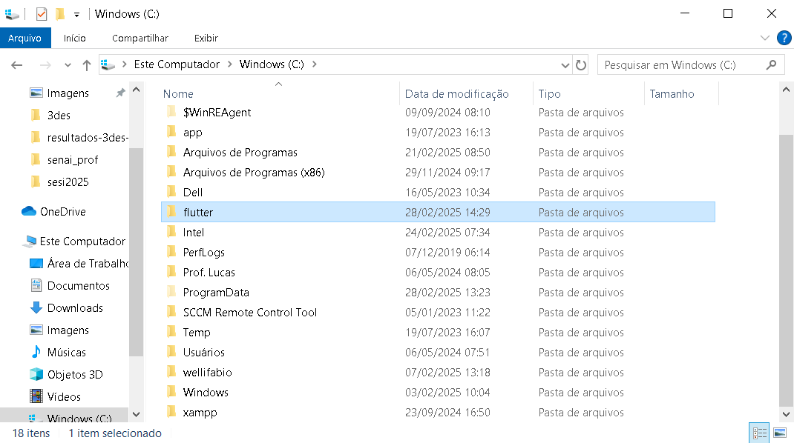
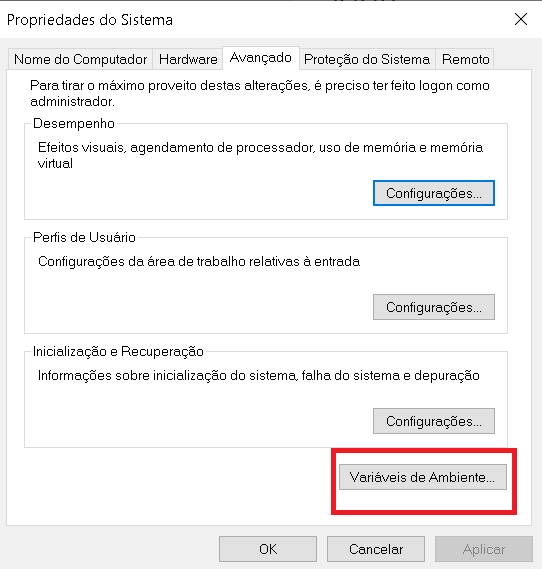
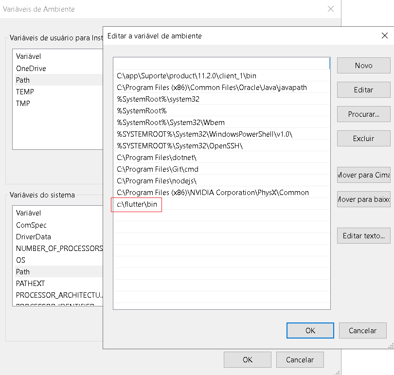
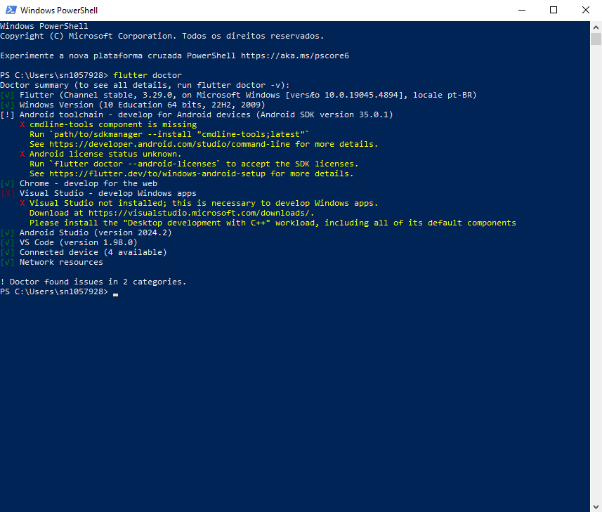
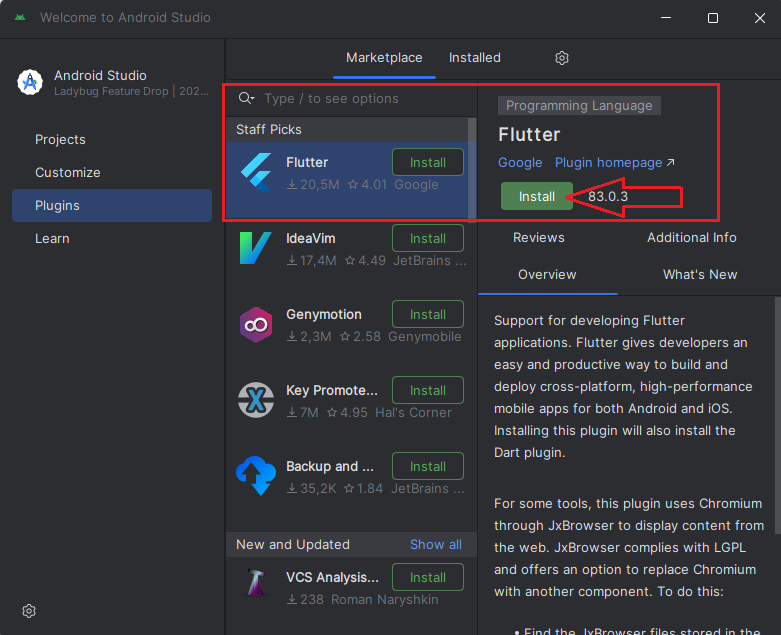
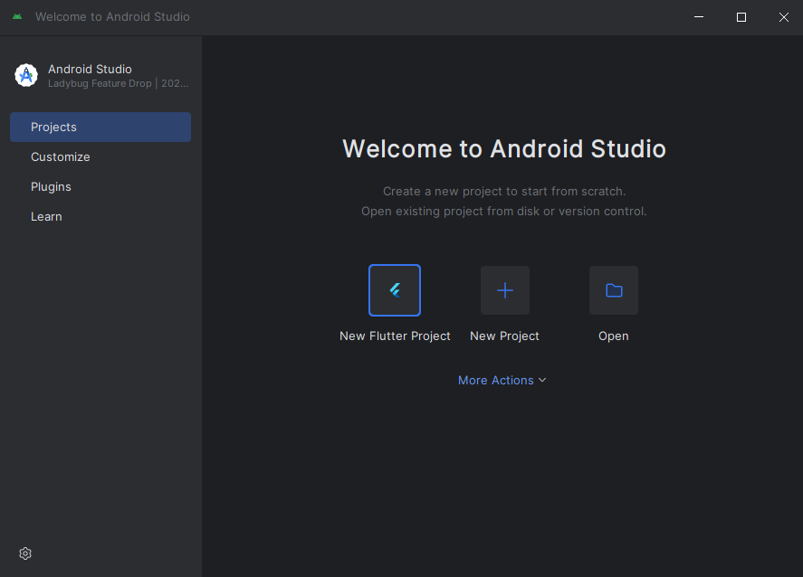
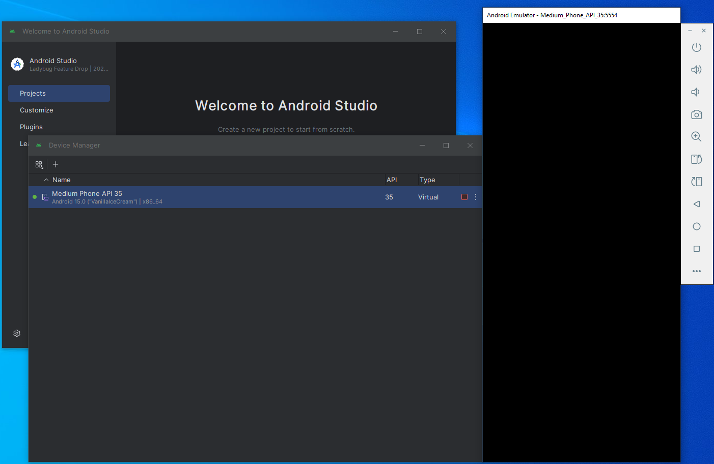
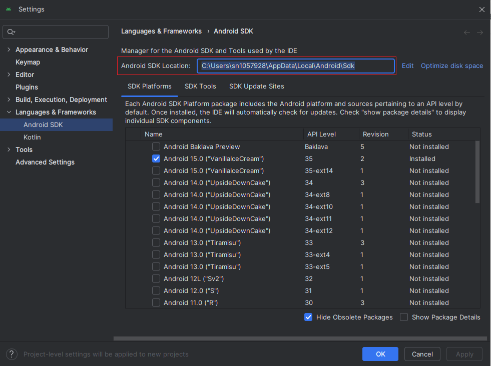

# Aula03 - Flutter
## 1. Introdução
- O Flutter é um framework para desenvolvimento de aplicações móveis multiplataforma, ou seja, com uma única base de código é possível criar aplicativos para Android e iOS.

## Ambiente
- Para desenvolver aplicações com Flutter é necessário instalar o Flutter SDK e o Android Studio.
- Android Studio - IDE (Integrated Development Environment) para desenvolvimento de aplicativos Android.
- Flutter SDK - Kit de desenvolvimento de software para Flutter.

## 2. Instalação
- Para instalar o Flutter SDK, siga os passos no site oficial do Flutter: https://flutter.dev/docs/get-started/install
    - Baixe no windows o arquivo .zip de instalação e descompacte em c:
    - Adicione o caminho da pasta bin do flutter no PATH do sistema c:\flutter\bin
    - O Android Studio, basta baixar, instalar tradicionamlente [Next, Next, Finish] e adicionar o plugin do Flutter.
    - 
    - Configurar a variável de ambiente do sistema, para isso, em executar digite `sysdm.cpl` e clique em `Variáveis de Ambiente`
    - 
    - 
    - Ao concluir as instalações e configuração da variável de embiente, reinicie o computador e abra um terminal para verificar se o flutter foi instalado corretamente com o comando `flutter doctor`
    - Além dos programas citados, é necessário instalar o Android SDK e o Android Virtual Device (AVD) para emular um dispositivo Android no computador.
    - E o ambiente padrão git e vscode para desenvolvimento.
    - Concluído execute o comando flutter doctor em um PowerShell como Administrador
    - 
    - Para iniciar um novo projeto e testar, Abrindo o **Android Studio** instale o **Plugin do Flutter** e um **emulador**
    - 
    - Instale um Emulador, ou abra o que já vem instalado por padrão (Medium Phoe ...)
    - 
    - 
### Obs: Caso ao executar um projeto flutter apresente erro ao fazer buid (Executar um programa inicial)
- Para correção instale a versão mais atual do flutter.
- Outra solução pode ser utilizar o JDK17 (jdk-17.0.12_windows-x64_bin)
- Para instalar basta fazer download, executar o arquivo e instalar pelo processo (next, next,.. finish)
- Após o processo executar o comando a seguir como administrador no powerShell
```powerShell
flutter config --jdk-dir 'C:/Program Files/Java/jdk-17/bin'
```
- Também configurar o android SDK
- 
```powerShell
flutter config --android-sdk 'C:/Users/usuario/AppData/Local/Android/Sdk'
```
- Reiniciar o computador e rodar um novo projeto no flutter
- Caso precise voltar a configuração original
```powerShell
flutter config --clear-features
```