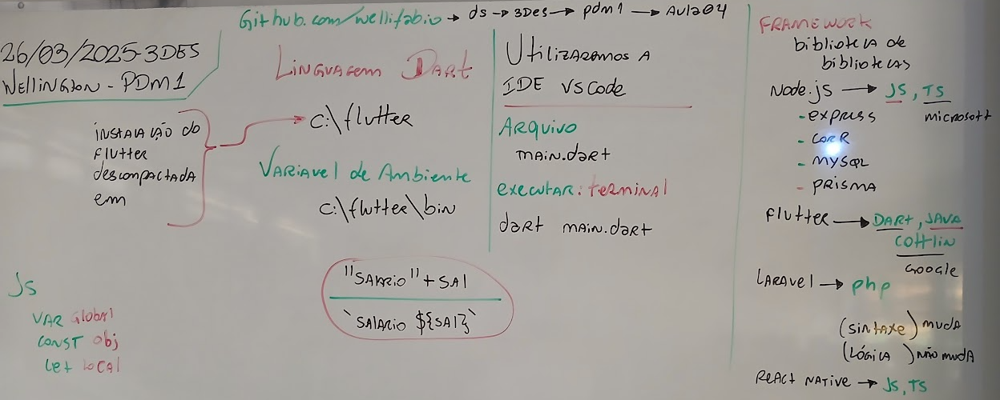
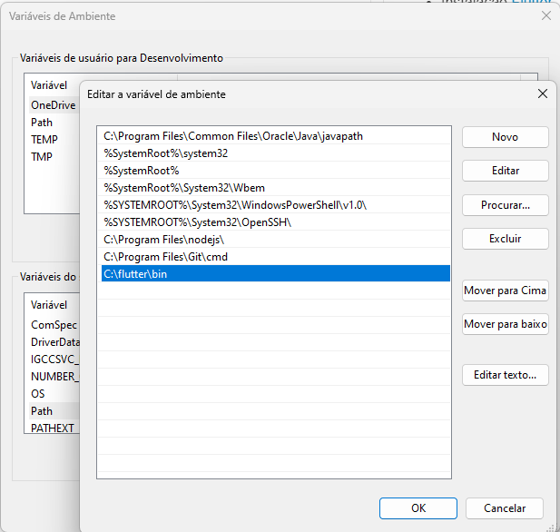

# Aula04 - DART

- Instalação [Flutter](https://docs.flutter.dev/get-started/install)
    - Instalar o flutter, descompactando em **C:\\**
    - Configurar a veriável de ambiente do sistema (RUM:sysdm.cpl) **path**
        - Adicionando **C:\flutter\bin**
- Site oficial do Dart https://dart.dev/
- 
## Demonstração
- Alô mundo em Dart
- main.dart
```dart
void main(){
    print('Alô mundo!');
}
```
- Estudo de **variáveis** e **Strings** em Dart
```dart
void main(){
    int x = 10;
    double y = 50.5;
    String texto = 'Qualquer coisa';
    bool vf = true;
    var semtipo = 'oi';
    dynamic dinamico = 'oi';

    //Saída com concatenação de string
    print("O valor de x é " + x.toString());
    print("O valor de y é " + y.toString());
    print("O valor de texto é " + texto);
    //Saída com template String
    print("O valor de x é ${x}");
    print("O valor de y é ${y}");
    print("O valor de texto é ${texto}");
    print("O valor de vf é ${vf}");
    print("O valor de semtipo  é ${semtipo}");
    print("O valor de semtipo  é ${semtipo}");
    print("O valor de dinamico  é ${dinamico}");
    dinamico = 50.9;
    print("O valor de dinamico  é ${dinamico}");
}
```
- Estudo de **funções**
```dart
void main(){
    //Variáveis simples
    int v1 = 1253;
    int v2 = 3261;

    //Listas ou Vetores
    List<double> numeros = [9.9,85.08,99.9,74,100,85]; 

    //Chamando a função que soma dois múmeros
    int resultado = somaDois(v1,v2);

    //Mostrando o resultado
    print('A soma de ${v1} + ${v2} é ${resultado}');

    //Chamando a função que soma vários números
    double total = somaVarios(numeros);

    //Mostrando o resultado
    print('O total da soma de ${numeros} é ${total}');

    //Exercício01: Crie uma função que multiplique dois números inteiros e retorne o resultado
    //Exercício02: Crie uma função que divida dois números reais e retorne o resultado,
    // caso o divisor seja 0 imprima a mensagem 'Proibido dividir por 0' e retorne -1
    //Desafio: Crie uma função que calcule o fatorial de um número: Teste com números menores que 50
}

int somaDois(int a, int b){
    return a + b;
}

double somaVarios(List<double> vetor){
    double total = 0;
    for(var i = 0; i < vetor.length; i++){
        total += vetor[i];
    }
    return total;
}
```
- Estudo de **Entradas** de dados via teclado
```dart
// Crie um programa que solicite ao usuário que informe sua idade e classifique-o
// Para entrada de dados precisamos da biblioteca dart:io
import 'dart:io';

void main(){
    int idade;
    print('Digite sua idade: ');
    //Entrada sempre é com String
    String? e = stdin.readLineSync();
    if(e != null){
        //Para operações lógicas ou matemáticas devemos converter de String para numerico
        idade = int.parse(e);
        if(idade < 10) print('Você é criança.');
        else if(idade < 15) print('Você é adolescente.');
        else if(idade < 20) print('Você é jovem.');
        else if(idade < 30) print('Você é adulto(a).');
        else if(idade < 40) print('Você é maduro(a).');
        else if(idade < 50) print('Você está na meia idade.');
        else if(idade < 80) print('Você é idoso.');
        else print('Você tem muita experiência.');
    } else {
        print('Idade não válida');
    }
}
```
- Estudo de **Objetos** e **Classes**
```dart
void main(){
    //Instância prod da classe Produto
    Produto prod = new Produto();
    //Configurando o objeto
    prod.id = 1;
    prod.nome = 'Camiseta';
    prod.preco = 39.9;
    //Mostrando o objeto
    print(prod);
}

//Classe
class Produto{
    //Atributos
    int id = 0;
    String nome = '';
    String? descricao;
    double preco = 0;
    //Métodos
    toString(){
        return '$id, $nome, $descricao, $preco';
    }
}
```

## Exercícios em Dart
- 1 Desenvolva um programa que leia o preço de um produto e se o preço for maior do que 1000 reais aplique um desconto de 8%. Mostre o preço final.
- 2 Desenvolva um programa que leia o salário de um funcionário e o número de filhos. Se o salário for menor do que 2000 o funcionário receberá um salário família equivalente a 60 reais por filho. Apresente o salário final.
- 3 Desenvolva um programa que calcule desconto de INSS de um funcionário, pesquise "Tabela INSS" no google e faça os cálculos com a tabela atualizada. Mostre o desconto e o valor do salário final.
- 4 Desenvolva um programa que leia os valores de três lados de um triângulo (a, b e c) e se os três lados forem diferentes escreva ESCALENO se os três lados forem iguais EQUILÁTERO e se apenas dois lados forem iguais ISÓSCELES.