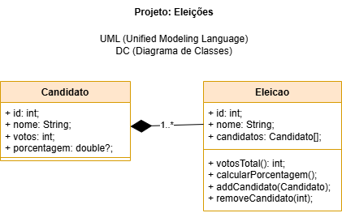

# Aula05 - POO Programação Orientada a Objetos

## Pilares
- Abstração
- Encapsulamento
- Polimorfismo
- Herança

### Abstração
Separar o problema maior em métodos menores reaproveitáveis ex:
```dart
    votosTotal() {
        int total = 0;
        for (var candidato in candidatos) {
            total += candidato.votos;
        }
        return total;
    }
```
O método acima calcula o total de votos da eleição para de pois podermos calcular a porcentagem.

### Encapsulamento
Evitar o acesso direto aos **atributos** fazer isso pelos métodos (get, set ou constutores e toString), ex:
```dart
  //Método construtor (Entrada)
  Candidato(this.id, this.nome, this.votos);
  //Método toString (Saída)
  String toString() {
    return '{id: $id, nome: $nome, votos: $votos}';
  }
```
### Polimorfismo
Sobrecarga ou sobrescrita de métodos, nos programas a seguir temos o exemplo do método sobrescrito @override
```dart
  @override
  String toString() {
    return '{id: $id, nome: $nome, votos: $votos}';
  }
```
Para utilizálo basta exibir o ojeto:
```dart
print(candidato);
```
### Herança
É a capacidade de uma classe herdar atributos e métodos de outra classe, veremos exemplo em outras aulas

### Exemplo Método Construtor
- Método de entrada construtor, método que possui o mesmo nome da Classe.
- Método de saída toString
```dart
import 'dart:io';

class Candidato {
  //Atributos
  int id = 0;
  String nome = '';
  int votos = 0;

  //Método construtor
  Candidato(this.id, this.nome, this.votos);
  //Metodo toString
  @override
  String toString() {
    return '{id: $id, nome: $nome, votos: $votos}';
  }
}

void main(){
    String? entrada;
    String nome;
    int votos;
    while(entrada == null){
        print('Digite o nome do candidato: ');
        entrada = stdin.readLineSync();
    }
    nome = entrada;
    entrada = null;
    while(entrada == null){
        print('Digite a quantidade de votos: ');
        entrada = stdin.readLineSync();
    }
    votos = int.parse(entrada!);
    entrada = null;
    //Utilizando o método construtor
    Candidato candidato = Candidato(1, nome, votos);
    //Exibindo os dados utilizando o método toString
    print(candidato);
}
```

## Desafios
<table>
<tr>
<td><b>Desafio</b></td><td><b>Exemplo de saída</b></td>
</tr>
<tr>
<td>

- 1 Crie um programa que calcule a porcentagem de votos de candidatos:
    - Deve possuir um menú com opções de adicionar, excluir, mostrar porcentagem e sair.
    - Ao adicionar um candidato deve pedir o nome e a quantidade de votos
    - Ao mostrar a lista exiba na tela o nome dos candidatos, total e a porcentagem de votos de cada um.
</td>
<td>

```bash
dart candidatos.dart
1 - Adicionar candidato
2 - Excluir candidato
3 - Mostrar porcentagem de votos
4 - Sair
1
Digite o nome do candidato:
Lula
Digite a quantidade de votos:
100
1 - Adicionar candidato
2 - Excluir candidato
3 - Mostrar porcentagem de votos
3 - Mostrar porcentagem de votos
4 - Sair
1
Digite o nome do candidato:
Jair
Digite a quantidade de votos:
50
1 - Adicionar candidato
2 - Excluir candidato
3 - Mostrar porcentagem de votos
4 - Sair
1
Digite o nome do candidato:
Jurema
Digite a quantidade de votos:
75
1 - Adicionar candidato
2 - Excluir candidato
3 - Mostrar porcentagem de votos
4 - Sair
3
Candidatos      Votos   Porcentagem
Lula    100     44.44%
Jair    50      22.22%
Jurema  75      33.33%
1 - Adicionar candidato
2 - Excluir candidato
3 - Mostrar porcentagem de votos
4 - Sair
```
</td>
</tr>
<tr>
<td colspan=2>

- 2 Crie um programa com funcionalidades semelhantes a acima, porém que liste e classifique pacientes aptos ou não aptos a tomar a vacina contra a dengue.
    - Como entrada deve receber o nome do paciente, idade e sexo:
    - Estão aptos homens entre 14 e 50 anos e mulheres entre 20 e 40 anos de idade.

</td>
</tr>
</table>

### Solução Desafio 01

```dart
import 'dart:io';

class Candidato {
  //Atributos
  int id = 0;
  String nome = '';
  int votos = 0;
  double? porcentagem;

  //Métodos
  //Construtor
  Candidato(this.id, this.nome, this.votos, [this.porcentagem]);

  @override
  String toString() {
    return '|$id|$nome|$votos|$porcentagem|';
  }
}

class Eleicao {
    //Atributos
    int id = 0;
    String nome = '';
    List<Candidato> candidatos = [];
   
   //Métodos
    Eleicao(this.id, this.nome);

    votosTotal() {
        int total = 0;
        for (var candidato in candidatos) {
            total += candidato.votos;
        }
        return total;
    }

    calcularPorcentagem(){
        for (var candidato in candidatos) {
            candidato.porcentagem = (candidato.votos / votosTotal()) * 100;
        }
    }

    addCandidato(Candidato candidato){
        candidatos.add(candidato);
        calcularPorcentagem();
    }

    removeCandidato(int id){
        candidatos.removeWhere((candidato) => candidato.id == id);
        calcularPorcentagem();
    }

    @override
    String toString() {
        return '{id: $id, nome: $nome, candidatos: $candidatos}';
    }
}

void main(){
    Eleicao eleicao = Eleicao(1, 'Representante de turma');
    int menu = 0;
    while (menu != 4){
        print('1 - Adicionar candidato\n2 - Remover candidato\n3 - Mostrar resultados\n4 - Sair');
        menu = int.parse(stdin.readLineSync()!);
        switch (menu) {
            case 1:
                int id = eleicao.candidatos.isEmpty ? 1 : eleicao.candidatos[eleicao.candidatos.length - 1].id + 1;
                print('Digite o nome do candidato: ');
                String nome = stdin.readLineSync()!;
                print('Digite a quantidade de votos do candidato: ');
                int votos = int.parse(stdin.readLineSync()!);
                Candidato candidato = Candidato(id, nome, votos);
                eleicao.addCandidato(candidato);
                break;
            case 2:
                print('Digite o id do candidato: ');
                int id = int.parse(stdin.readLineSync()!);
                eleicao.removeCandidato(id);
                break;
            case 3:
                for (var candidato in eleicao.candidatos) {
                    print(candidato);
                }
                break;
            case 4:
                print('Saindo...');
                break;
            default:
                print('Opção inválida!');
        }
    }
}
```
### Desafio 03
- Ao exibir os candidatos e porcentagens informe se o primeiro candidato seria eleito em primeiro turno ou se haverá segundo turno.