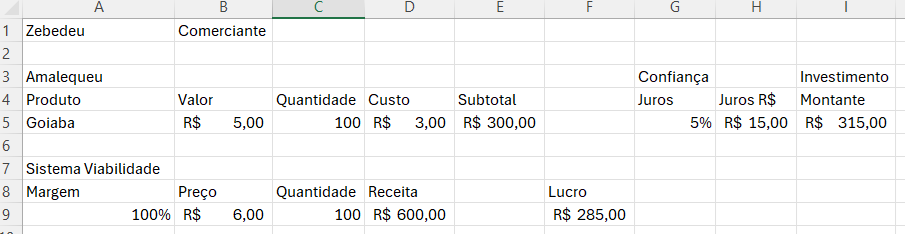
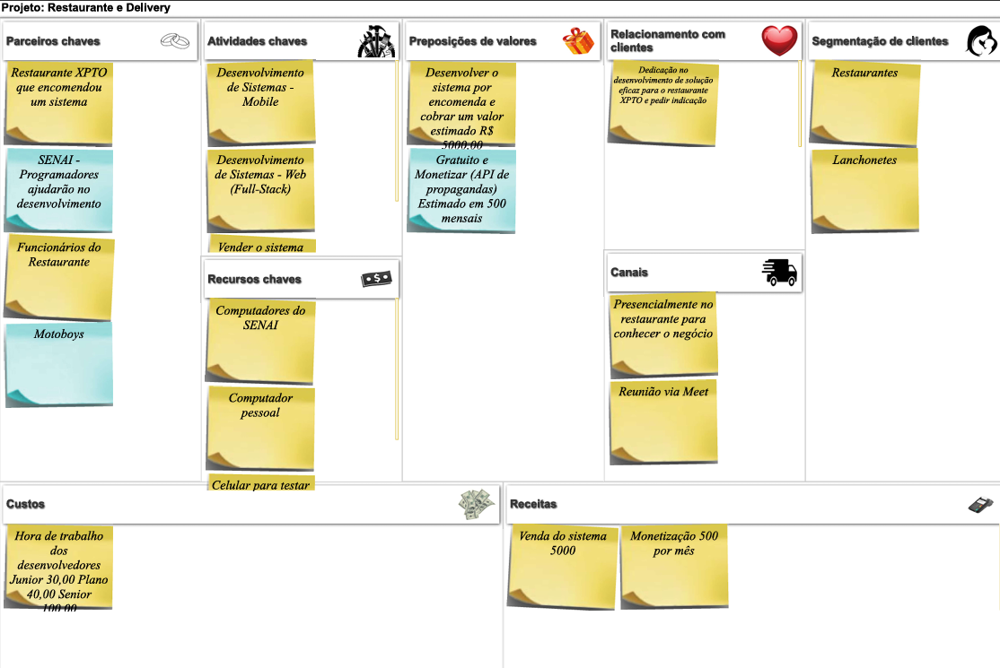

# Aula04 - Modelos de Negócio
- Regras de negócio

## Seguimentação de mercado
- Comércio
- Indústria
- Serviços

## Conceitos básicos de administração
- Valor: Média dos preços de produtos
- Custo: Quanto o comerciante paga pelo produto
- Preço: Por quanto o comerciante vende o produto
- Receita: O total em dinheiro após a venda de todos os produtos
- Despesas: Custo de aluguel, salários, constas de água, etc.
- Investimento: Total gasto na compra das mercadorias

## Quadro Canvas
Uma maneira de modelar um negócio é utilizando o quadro Canvas.
- A seguir temos um exemplo para o desenvolvimento de um  sistema para um restaurante que fornece comida no local e entregas.
- 

## Atividade
Utilizando a [ferramenta canvas](https://wellifabio.github.io/canvas/) preecha o quadro para o seu projeto e gere o PDF para entregar na próxima aula.