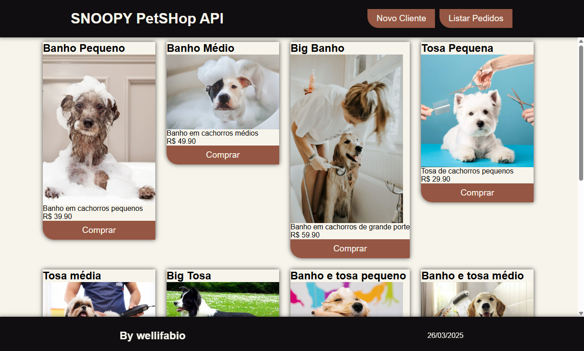
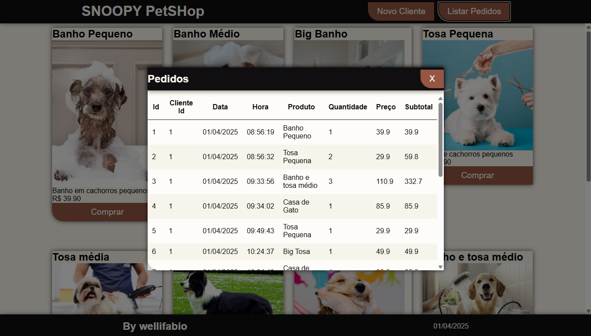
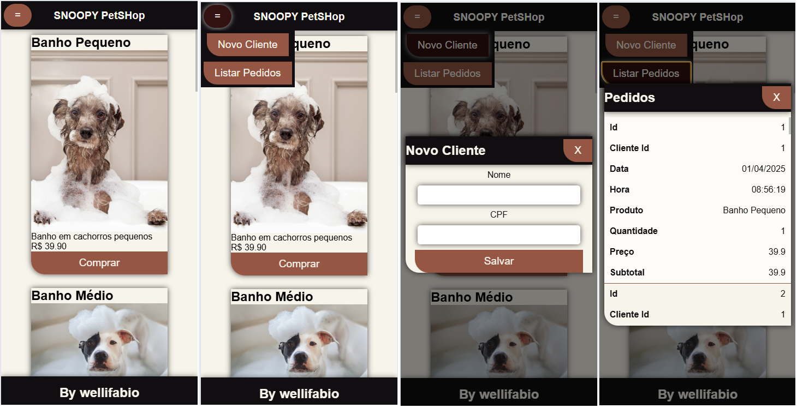

# Aula05 - Projeto Web Full-Stack

## Capacidades Técnicas
- 2 Definir a infraestrutura física a ser utilizada no desenvolvimento dos componentes  
- 3 Projetar os componentes do sistema considerando as plataformas computacionais

## Conhecimentos
- Programação Front-End
- Integração Front-End x Back-End
- Consumo de API com fetch (JavaScript[vanilla])
- UX (User experience) e UI (User Interface)
    - Responsividade
        - Dimensões vw, vh
        - @media (CSS) query
        - Tabela responsiva
    - **Modais**
        - Abrir e fechar formulários e tabelas em modais
        - Tabela zebrada

## Infraestrutura física
|Stack|Tecnologia|
|-|-|
|Front-End|Servidor Live Server VsCode|
|Front-End|Modelo HTML|
|Front-End|Visão CSS|
|Front-End|Controle JavaScript|
|Back-End|Framework Node.JS|
|Back-End|IDE VsCode|
|Back-End|ORM Prisma|
|Back-End|Framework XAMPP|
|Back-End|SGBD MySQL|

## API iniciada em aula anterior de PBE1 (Back-end)
- Crie um **fork** do **[projeto SNOOPY PetShop](https://github.com/wellifabio/psof2-snoopy-petshop-2025.git)** iniciado em aula anterior, acrescente seu login no nome do repositorio ex: **pbe2-aula03-prisma-2025-luisfernando**.
- Clone o projeto que fez o fork na área de trabalho.
- Abra com VsCode e inicie a codificação do Front-End conforme wireframes e regras de negócio a seguir.
    - **Mais Instruções**
    - É para trabalhar no projeto que você fez **fork**, pois os end-points estão mais completos.
    - Crie uma pasta chamada **web** dentro dela os arquivos index.html, style.css e script.js

## Contextualização
O projeto **SNOOPY PetShop** foi iniciado em aula de back-end, refere-se a um sistema para registro de vendas de produtos ou serviços no balcão de atendimento de qualquer petshop. Nesta situação problema, você é um programa dor full-stack e fica encumbido de desenvolver o front-end do sistema, criando uma web UI conforme descrição a seguir:
### Desafio01
- Tela principal
    - Cabeçalho (Header)
        - Título e menu com as opções (Novo Cliente, Listar Pedidos)
    - Principal (Main)
        - Cards listando todos os produtos e um botão comprar em cada card
    - Rodapé (Footer)
        - Autor e Data
#### Paleta de Cores
- #100E10
- #321110
- #955643
- #F7F4EB
- rgba(0,0,0,0.7)
- rgba(255,255,255,0.7)
#### Fontes
- Arial, Helvetica, sans-serif
#### Lista de Produtos
Na pasta web, crie uma subpasta chamada assets e um arquivo produtos.json contendo:
- ./web/assets/produtos.json
```json
[
    {
        "id": 1,
        "produto": "Banho Pequeno",
        "descricao": "Banho em cachorros pequenos",
        "preco": 39.9,
        "imagem": "https://conteudo.imguol.com.br/c/entretenimento/5e/2016/12/08/banho-cachorro-1481227592481_v2_3x4.jpg"
    },
    {
        "id": 2,
        "produto": "Banho Médio",
        "descricao": "Banho em cachorros médios",
        "preco": 49.9,
        "imagem": "https://blog-static.petlove.com.br/wp-content/uploads/2022/02/cachorro-espuma-banho-Petlove.jpg"
    },
    {
        "id": 3,
        "produto": "Big Banho",
        "descricao": "Banho em cachorros de grande porte",
        "preco": 59.9,
        "imagem": "https://mypetprince.com.br/wp-content/uploads/2019/04/autri-taheri-521018-unsplash.jpg"
    },
    {
        "id": 4,
        "produto": "Tosa Pequena",
        "descricao": "Tosa de cachorros pequenos",
        "preco": 29.9,
        "imagem": "https://p2.trrsf.com/image/fget/cf/1200/1200/middle/images.terra.com/2024/01/11/2008554773-tosa-animal.jpg"
    },
    {
        "id": 5,
        "produto": "Tosa média",
        "descricao": "Tosa de cachorros médios",
        "preco": 39.9,
        "imagem": "https://blog-static.petlove.com.br/wp-content/uploads/2020/12/devo-tosar-pet-verao-petlove.jpg"
    },
    {
        "id": 6,
        "produto": "Big Tosa",
        "descricao": "Tosa de cachorros de grande porte",
        "preco": 49.9,
        "imagem": "https://comomontarpetshop.com.br/wp-content/uploads/2020/04/border.jpg"
    },
    {
        "id": 7,
        "produto": "Banho e tosa pequeno",
        "descricao": "Banho e tosa de cachorros pequenos",
        "preco": 59.9,
        "imagem": "https://blog.vhsys.com.br/wp-content/uploads/2023/04/9-dicas-de-gestao-para-quem-tem-um-banho-e-tosa-pequeno.png"
    },
    {
        "id": 8,
        "produto": "Banho e tosa médio",
        "descricao": "Banho e tosa de cachorros médios",
        "preco": 110.9,
        "imagem": "https://foxvet.com.br/wp-content/uploads/2022/07/banner-banho-tosa-perguntas-frequentes-1200x675.jpg"
    },
    {
        "id": 9,
        "produto": "Coleira",
        "descricao": "Coleira para cachorros",
        "preco": 25.9,
        "imagem": "https://encrypted-tbn0.gstatic.com/images?q=tbn:ANd9GcRptWC0kJeUQUtg8S8g3iFtUSVdwx_BLaaPIg&s"
    },
    {
        "id": 10,
        "produto": "Casa de Gato",
        "descricao": "Casa para gatos",
        "preco": 85.9,
        "imagem": "https://cdn.leroymerlin.com.br/products/casa_para_gato_arranhador_com_rede_caramelo_e_bege_lilies_mov_1570552740_96e2_600x600.jpg"
    }
]
```
#### Wireframes




### Obs:
- O **Front-end** do projeto com exemplo dos conhecimentos citados na aula encontra-se implementado no repositório.